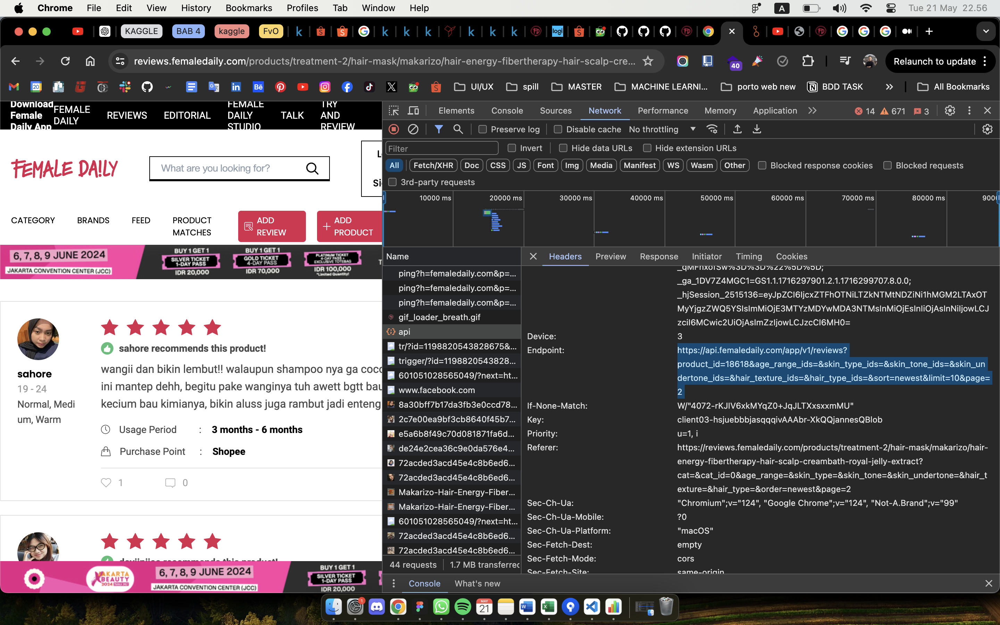

## Url page: 
 
https://reviews.femaledaily.com/products/moisturizer/sun-protection-44/emina/sun-protection-spf-30-pa?cat=&cat_id=0&age_range=&skin_type=&skin_tone=&skin_undertone=&hair_texture=&hair_type=&order=newest&page=1
 

 

## Setup run.py ##

- Buat virtual environment -> python -m venv env
- Activate environment -> source env/bin/activate (linux dan mac)
- Install requirement.txt ->  pip install -r requirements.txt
- Jalankan -> python run.py 
